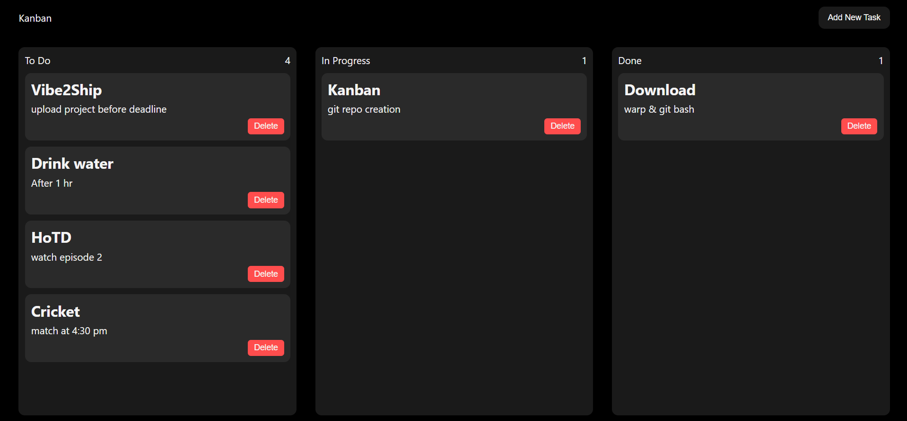

# 📋 Kanban Task Board

A simple and interactive **Kanban Task Board** built using **HTML, CSS, and Vanilla JavaScript**. It allows users to create, organize, and manage tasks using drag-and-drop functionality while automatically saving data in the browser using **Local Storage**.

---

## 🌐 Live Demo

🚀 **Coming Soon**

> *Update this section after deploying your project using GitHub Pages, Netlify, or Vercel.*

---

## 📸 Preview

<p align="center">
  
</p>

---

## ✨ Features

- ➕ Add new tasks using a modal form
- 📝 Add task title and description
- 🖱️ Drag and drop tasks between columns
- 🗑️ Delete tasks instantly
- 🔢 Live task count for each column
- 💾 Automatic data persistence using Local Storage
- 🎨 Modern dark-themed UI
- ⚡ Built with Vanilla JavaScript (No frameworks)

---

## 📂 Project Structure

```text
kanban-board/
│
├── assets/
│   └── Screenshot1.png
├── index.html
├── style.css
├── script.js
└── README.md
```

---

## 🚀 Getting Started

### 1. Clone the repository

```bash
git clone https://github.com/your-username/kanban-board.git
```

### 2. Navigate to the project folder

```bash
cd kanban-board
```

### 3. Open the project

Simply open **index.html** in your preferred browser.

No installation or build tools are required.

---

## 📌 How to Use

1. Click **Add New Task**.
2. Enter a task title and description.
3. Click **Add Task**.
4. Drag tasks between:
   - 📌 To Do
   - 🚧 In Progress
   - ✅ Done
5. Delete tasks anytime using the **Delete** button.

All changes are automatically saved in your browser using **Local Storage**.

---

## 💾 Data Storage

The application stores all tasks in the browser using the **Local Storage API**, ensuring they remain available even after refreshing or reopening the page.

Example:

```json
{
  "todo": [
    {
      "title": "Learn JavaScript",
      "desc": "Practice DOM Manipulation"
    }
  ],
  "progress": [],
  "done": []
}
```

---

## 🛠️ Technologies Used

- HTML5
- CSS3
- Vanilla JavaScript
- Local Storage API
- HTML5 Drag and Drop API

---

## 🌐 Browser Support

This project works on all modern browsers including:

- Google Chrome
- Microsoft Edge
- Mozilla Firefox
- Brave
- Opera

---

## 📚 What I Learned

Building this project helped me improve my understanding of:

- DOM Manipulation
- Event Handling
- Dynamic Element Creation
- HTML5 Drag & Drop API
- Local Storage
- JavaScript Arrays & Objects
- CSS Variables
- Flexbox Layout
- Responsive UI Design

---

## 🎯 Future Improvements

- ✏️ Edit existing tasks
- ⭐ Task priorities
- 📅 Due dates
- 🔍 Search & filter tasks
- 🏷️ Labels and categories
- 🌙 Light/Dark mode toggle
- 📱 Better mobile drag-and-drop support
- 📤 Export/Import tasks
- 👥 Multiple Kanban boards
- ☁️ Backend database integration

<!-- ---

<!-- ## 📄 License

This project is licensed under the **MIT License**. -->

---

## 👨‍💻 Author

**krpranav7**

Built with ❤️ using **HTML, CSS, and JavaScript**.

---

## ⭐ Support

If you found this project useful, consider giving it a **⭐ Star** on GitHub.

It helps others discover the project and motivates future improvements.